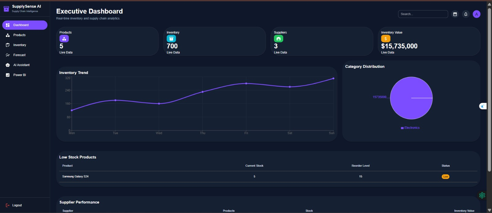
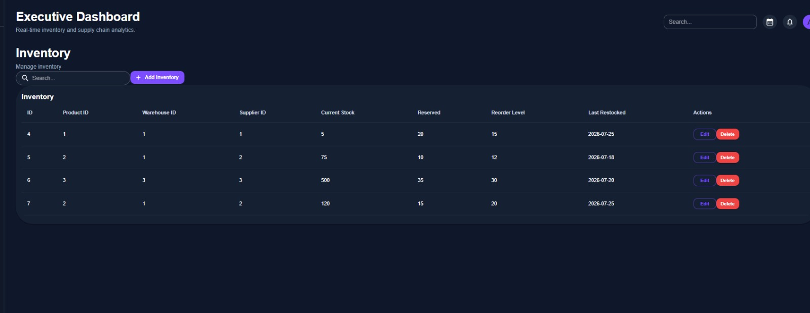
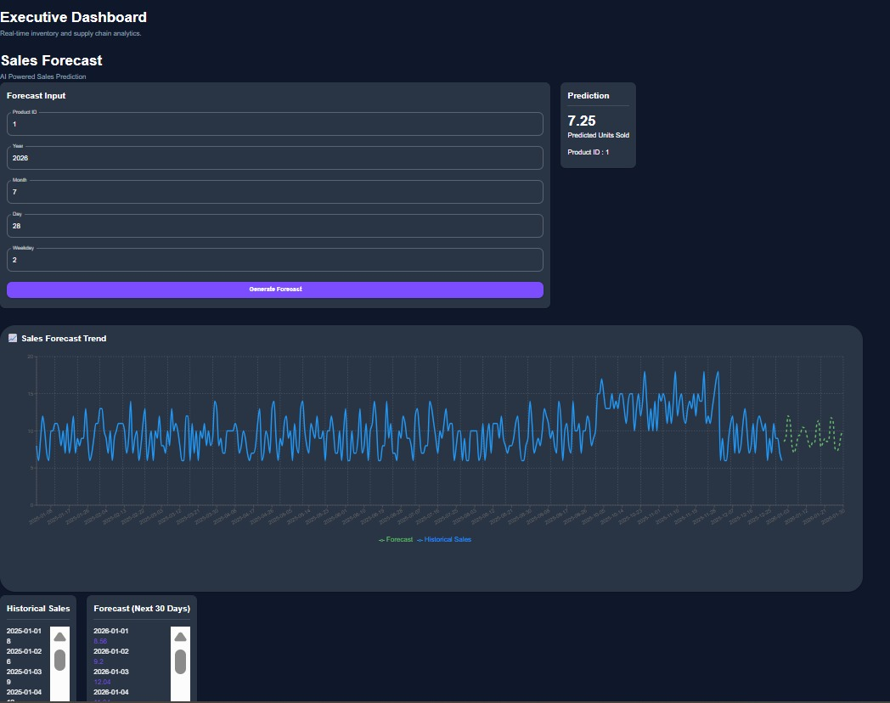
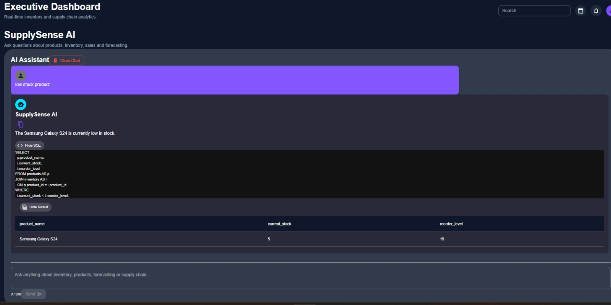
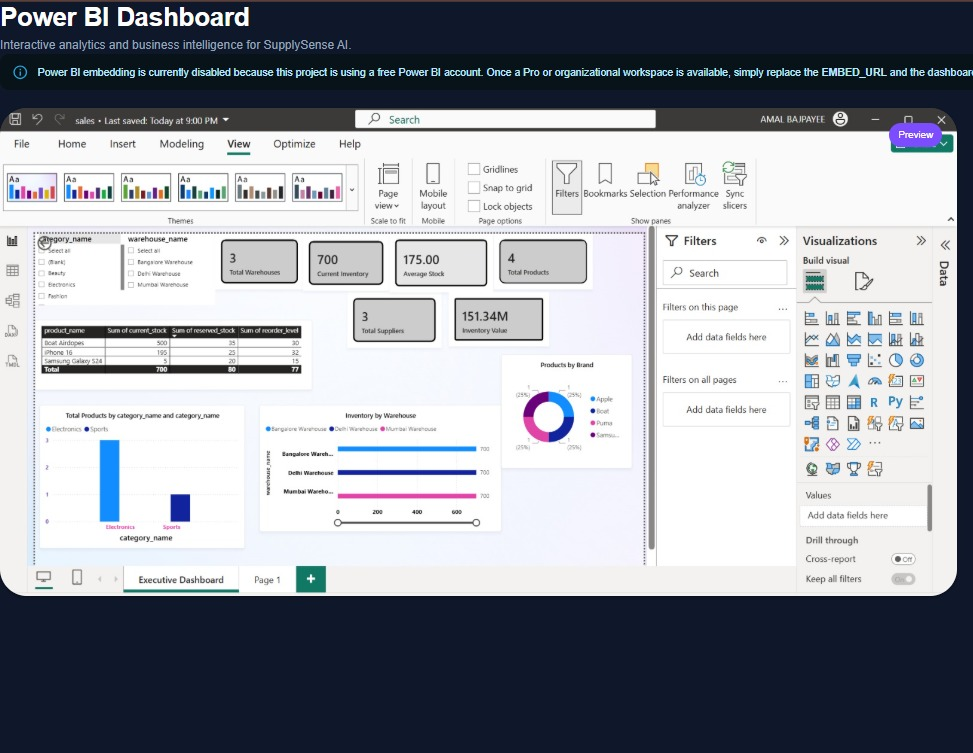

<div align="center">

# 🚀 SupplySense AI
### *AI-Powered Smart Inventory Management & Demand Forecasting Platform*

<p align="center">


</p>

*A modern AI-powered inventory intelligence platform that combines inventory management, demand forecasting, business analytics and natural language querying into a unified web application.*

---

</div>

# 📌 Overview

Managing inventory is no longer just about tracking stock levels.

Modern businesses require:

- Real-time inventory visibility
- Intelligent demand forecasting
- AI-assisted business insights
- Supplier monitoring
- Analytics-driven decision making

**SupplySense AI** was built to address these challenges by integrating Artificial Intelligence, Machine Learning and Business Intelligence into a single platform.

Instead of manually writing SQL queries or generating reports, users can simply ask questions in natural language such as:

> **"Which products are low in stock?"**

or

> **"Show inventory for Warehouse A."**

The AI Assistant converts the question into SQL, executes it securely and returns both the answer and generated query.

---

---

# 📸 Application Showcase

<p align="center">

## 🔐 Authentication


---

## 📊 Dashboard



---

## 📦 Products


---

## 🏬 Inventory



---

## 📈 Demand Forecasting



---

## 🤖 AI Assistant



---

## 📊 Power BI Dashboard



</p>

---

# ✨ Key Features

## 🔐 Secure Authentication

- JWT Authentication
- Protected Routes
- Login System
- Token Persistence
- Secure API Communication

---

## 📦 Product Management

- Create Products
- Update Products
- Delete Products
- Search Products
- Category Management
- Brand Management
- Clean Data Table UI

---

## 🏬 Inventory Management

Complete inventory lifecycle management.

Features include:

- Inventory CRUD
- Warehouse Tracking
- Supplier Mapping
- Current Stock
- Reserved Stock
- Reorder Level
- Last Restocked Date
- Search & Filtering

---

## 📈 AI Demand Forecasting

Machine Learning powered prediction module.

Supports:

- Product Selection
- Future Demand Prediction
- Historical Forecast
- Forecast Comparison
- Interactive Charts

---

## 🤖 AI Business Assistant

One of the major highlights of this project.

The assistant enables users to interact with the database using natural language.

Example queries:

```text
Which product has the lowest stock?

Show inventory of Warehouse 2

List all suppliers

Products with reorder level below stock
```

The AI automatically:

```
Question

      │

      ▼

Generate SQL

      │

      ▼

Validate Query

      │

      ▼

Execute SQL

      │

      ▼

Generate Human Friendly Response
```

Users can also:

- View generated SQL
- View returned records
- Copy responses
- Expand/Collapse SQL
- Expand/Collapse Result Table

---

## 📊 Business Intelligence Dashboard

Dedicated Power BI analytics module.

Current implementation includes:

- Power BI Dashboard Page
- Dashboard Preview
- Future-ready Embed Architecture
- Responsive Layout

The page is designed so that embedding can be enabled by simply replacing the Power BI embed URL.

---

# 🖥 Application Modules

| Module | Status |
|---------|--------|
| Authentication | ✅ Completed |
| Dashboard | ✅ Completed |
| Products | ✅ Completed |
| Inventory | ✅ Completed |
| Forecasting | ✅ Completed |
| AI Assistant | ✅ Completed |
| Power BI | ✅ Completed |

---

# 🛠 Tech Stack

## Frontend

- React 19
- Material UI
- React Router
- Axios
- React Hook Form
- Vite

---

## Backend

- FastAPI
- Python
- SQLAlchemy
- JWT Authentication
- Pydantic

---

## Database

- MySQL

---

## AI & Analytics

- Google Gemini AI
- SQL Generation
- Natural Language Querying
- Demand Forecasting
- Power BI

---

# 🏗 High Level Architecture

```text
                     +----------------------+
                     |     React Frontend   |
                     +----------+-----------+
                                |
                                |
                     REST API (JWT)
                                |
                                ▼
                     +----------------------+
                     |      FastAPI         |
                     +----------+-----------+
                                |
               +----------------+----------------+
               |                                 |
               ▼                                 ▼
      Gemini AI Service                    MySQL Database
               |                                 |
               +----------------+----------------+
                                |
                                ▼
                     AI Generated Insights
```

---

# 🎯 Project Objectives

The primary goals of this project were:

- Build a scalable inventory management platform.
- Integrate Artificial Intelligence into business workflows.
- Provide demand forecasting capabilities.
- Reduce manual SQL writing through AI.
- Improve decision making with business intelligence.
- Demonstrate full-stack engineering using modern technologies.

---# 📂 Project Structure

```text
SupplySense-AI/
│
├── backend/
│   ├── app/
│   │   ├── api/
│   │   ├── core/
│   │   ├── database/
│   │   ├── models/
│   │   ├── schemas/
│   │   ├── services/
│   │   └── main.py
│   │
│   ├── requirements.txt
│   └── .env
│
├── frontend/
│   ├── src/
│   │
│   ├── assets/
│   ├── components/
│   │
│   │   ├── ai/
│   │   ├── charts/
│   │   ├── common/
│   │   ├── forms/
│   │   └── layout/
│   │
│   ├── pages/
│   │   ├── Dashboard.jsx
│   │   ├── Products.jsx
│   │   ├── Inventory.jsx
│   │   ├── Forecast.jsx
│   │   ├── AI.jsx
│   │   └── PowerBI.jsx
│   │
│   ├── services/
│   │
│   ├── App.jsx
│   └── main.jsx
│
└── README.md
```

---

# 🚀 Getting Started

## Clone Repository

```bash
git clone https://github.com/your-username/SupplySense-AI.git
```

```bash
cd SupplySense-AI
```

---

# ⚙ Backend Setup

Create virtual environment

```bash
python -m venv venv
```

Activate

### Windows

```bash
venv\Scripts\activate
```

### Linux / Mac

```bash
source venv/bin/activate
```

Install dependencies

```bash
pip install -r requirements.txt
```

Run server

```bash
uvicorn app.main:app --reload
```

Backend

```
http://localhost:8000
```

Swagger

```
http://localhost:8000/docs
```

---

# ⚛ Frontend Setup

Go to frontend

```bash
cd frontend
```

Install packages

```bash
npm install
```

Run

```bash
npm run dev
```

Frontend

```
http://localhost:5173
```

---

# 🔑 Environment Variables

Backend

```env
DATABASE_URL=

SECRET_KEY=

ALGORITHM=HS256

ACCESS_TOKEN_EXPIRE_MINUTES=60

GEMINI_API_KEY=
```

---

# 📡 Major Backend APIs

## Authentication

| Method | Endpoint |
|----------|----------------|
| POST | /login |

---

## Products

| Method | Endpoint |
|----------|----------------|
| GET | /products |
| POST | /products |
| PUT | /products/{id} |
| DELETE | /products/{id} |

---

## Inventory

| Method | Endpoint |
|----------|----------------|
| GET | /inventory |
| POST | /inventory |
| PUT | /inventory/{id} |
| DELETE | /inventory/{id} |

---

## Forecast

| Method | Endpoint |
|----------|----------------|
| POST | /forecast/predict |
| GET | /forecast/history/{id} |
| GET | /forecast/comparison/{id} |

---

## AI Assistant

| Method | Endpoint |
|----------|----------------|
| POST | /ai/query |
| POST | /ai/ask |

---

# 🤖 AI Assistant Workflow

```text
User Question

        │

        ▼

Gemini AI

        │

        ▼

Generate SQL

        │

        ▼

SQL Validation

        │

        ▼

Database Execution

        │

        ▼

Natural Language Answer

        │

        ▼

React Frontend
```

---

# 📷 Application Preview

> Replace these placeholders with actual screenshots.

## 🔐 Login

```
docs/screenshots/login.png
```

---

## 📊 Dashboard

```
docs/screenshots/dashboard.png
```

---

## 📦 Products

```
docs/screenshots/products.png
```

---

## 🏬 Inventory

```
docs/screenshots/inventory.png
```

---

## 📈 Forecast

```
docs/screenshots/forecast.png
```

---

## 🤖 AI Assistant

```
docs/screenshots/ai-assistant.png
```

---

## 📊 Power BI

```
docs/screenshots/powerbi.png
```

---

# 💡 Key Engineering Decisions

✔ Modular React Architecture

✔ Service Layer Separation

✔ Component Reusability

✔ JWT-based Authentication

✔ FastAPI REST Architecture

✔ Material UI Design System

✔ AI-assisted SQL Generation

✔ Responsive Layout

✔ Scalable Folder Structure

✔ Clean API Separation

---

# 📈 Performance Considerations

- Reusable React Components
- Service-based API Layer
- Modular FastAPI Architecture
- Efficient Database Queries
- Clean Separation of Concerns
- Minimal UI Re-rendering
- Responsive Design
- Maintainable Folder Structure

---

# 🔒 Security

- JWT Authentication
- Protected Routes
- Input Validation
- SQL Validation before Execution
- FastAPI Schema Validation
- Secure API Communication
- Token-based Authorization
- Controlled Database Access

---

# 🎯 Possible Future Enhancements

- Docker Deployment
- Kubernetes Support
- Role-Based Access Control
- Email Notifications
- Inventory Alerts
- Barcode Integration
- Multi-Warehouse Analytics
- Supplier Performance Dashboard
- Predictive Restocking
- AI-powered Business Recommendations
- Export Reports (PDF / Excel)
- Live Power BI Embedding

---# 🌟 Project Highlights

### What makes SupplySense AI different?

Unlike a traditional CRUD inventory application, SupplySense AI combines multiple technologies into a single platform:

- 📦 Inventory Management
- 🤖 AI-powered Natural Language Querying
- 📈 Demand Forecasting
- 📊 Business Intelligence Dashboard
- 🔐 Secure JWT Authentication
- ⚡ FastAPI Backend
- ⚛ Modern React Frontend

The project demonstrates how Artificial Intelligence can simplify everyday business operations by allowing users to interact with enterprise data using natural language.

---

# 🎓 Learning Outcomes

This project provided practical experience in:

### Full Stack Development

- Building REST APIs using FastAPI
- Designing scalable React applications
- State management
- API integration
- Modular component architecture

---

### Database Design

- Relational database modeling
- CRUD operations
- Joins
- Query optimization
- Inventory data management

---

### Authentication & Security

- JWT Authentication
- Protected routes
- Request validation
- Secure API communication

---

### Artificial Intelligence Integration

- Google Gemini API integration
- Natural language to SQL conversion
- SQL validation pipeline
- AI-generated business insights

---

### UI / UX

- Material UI design system
- Responsive layouts
- Reusable components
- Dashboard-oriented interface

---

# 🚀 Future Roadmap

The current version establishes a strong foundation for future enterprise features.

Planned enhancements include:

- Docker deployment
- Kubernetes support
- Role-Based Access Control (RBAC)
- Email & notification service
- Barcode/QR code support
- Automated inventory alerts
- Advanced forecasting models
- AI-generated business recommendations
- Report export (PDF/Excel)
- Live Power BI embedding
- Cloud deployment (AWS/Azure)
- CI/CD pipeline integration

---

# 📈 Project Status

| Module | Status |
|----------|:------:|
| Authentication | ✅ |
| Dashboard | ✅ |
| Products | ✅ |
| Inventory | ✅ |
| Forecasting | ✅ |
| AI Assistant | ✅ |
| Power BI Integration Page | ✅ |
| Docker Support | 🚧 Planned |
| CI/CD | 🚧 Planned |

---

# 🤝 Contributing

Contributions, ideas and suggestions are welcome.

If you'd like to improve the project:

1. Fork the repository
2. Create a new feature branch

```bash
git checkout -b feature/your-feature
```

3. Commit your changes

```bash
git commit -m "Add new feature"
```

4. Push to your branch

```bash
git push origin feature/your-feature
```

5. Open a Pull Request

---

# 📝 License

This project is released under the **MIT License**.

Feel free to use, modify and learn from the code while preserving the original license.

---

# 👨‍💻 Author

**Amal Bajpayee**

Integrated B.Tech + M.Tech (Information Technology)

Indian Institute of Information Technology, Gwalior

---

## Connect

- GitHub: *Add your GitHub profile*
- LinkedIn: *Add your LinkedIn profile*

---

# 🙏 Acknowledgements

Special thanks to the open-source community and the technologies that made this project possible:

- React
- FastAPI
- Material UI
- MySQL
- SQLAlchemy
- Google Gemini
- Vite
- Python

---

<div align="center">

## ⭐ If you found this project useful, consider giving it a Star.

It helps others discover the project and encourages further development.

---

### 🚀 Built with React • FastAPI • MySQL • Gemini AI • Material UI

**SupplySense AI — AI-Powered Inventory Intelligence Platform**

</div>